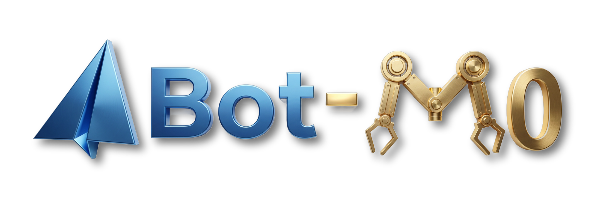

<div align="center">


<h1>ABot-M0: VLA Foundation Model for Robotic Manipulation with Action Manifold Learning</h1>

<p align="center">
  <b>AMAP CV Lab</b>
</p>


<p align="center">
  <a href="https://arxiv.org/abs/2602.11236"></a>
  <a href="https://amap-cvlab.github.io/ABot-Manipulation/"></a>
    <a href="https://huggingface.co/acvlab"></a>
    <a href="https://www.modelscope.cn/datasets/amap_cvlab/Abot-M0-MetaData"></a>
</p>

</div>


## 🌟 ABot-M0 is a general-purpose robotics model with the following core highlights:
<div style="text-align: center;">
  
</div>

- **Massive & Unified Data:** It integrates over 6 million open-source trajectories to form the largest unified dataset for robotic manipulation, providing a strong foundation for generalization.

- **Innovative Action Paradigm:** It pioneers Action Manifold Learning (AML), which directly predicts clean actions instead of noise, resulting in a more efficient and stable model.

- **Modular 3D Perception:** It supports plug-and-play modules to enhance 3D spatial understanding, improving execution precision for complex tasks.

---

## 📢 News
[2026-3-27] 🥳🥳**ABot-M0**'s 🎉🎉 [training code](https://github.com/amap-cvlab/ABot-Manipulation), [pre-trained weight](https://www.modelscope.cn/models/amap_cvlab/ABot-M0-Pretrain) and [data](https://www.modelscope.cn/datasets/amap_cvlab/Abot-M0-MetaData) are now available.🎉🎉

[2026-2-27] 🥳🥳**ABot-M0**'s The [weights](https://huggingface.co/acvlab) and [inference code](https://github.com/amap-cvlab/ABot-Manipulation) have been released. And updated the latest result of ABot-M0 on RoboTwin2.0 to 86.1. The full content will be released soon.🎉🎉

[2026-2-11] 🥳🥳**ABot-M0**'s [technical report](https://arxiv.org/abs/2602.11236) have been released. Weights and codes are coming soon. 🎉🎉

---


## Table of Contents
- [🛠️ Installation](#-Installation)
- [🏆 Model Zoo](#-Model-Zoo)
- [📈 Training and Evaluation](#-Training-and-Evaluation)
- [📜 Citing](#-Citing)
- [🙏 Acknowledgement](#-acknowledgement)

## 🛠️ Installation

For a full setup guide, the SimStackBowls training path, and a quick-start for your own LeRobot dataset, see `INSTALLATION.md`.

Create the required environment through the following steps:


```bash
# Clone the repo
git clone https://github.com/amap-cvlab/ABot-Manipulation.git
git clone https://github.com/facebookresearch/vggt.git
cd ABot-Manipulation

# Create conda environment
conda create -n ABot python=3.10 -y
conda activate ABot

# Install the CUDA 12.1 PyTorch stack first. This matches VGGT and is the most stable
# combination for ABot training + FlashAttention2.
pip install torch==2.3.1 torchvision==0.18.1 torchaudio==2.3.1 --index-url https://download.pytorch.org/whl/cu121

# Install the tested training dependency set without letting later installs drift
# to the torch/cu128 stack.
pip install -r requirements.txt -c constraints/abot-train-cu121.txt

# Install vggt
pip install -e path_to_vggt

# Install ABot
pip install -e .

# If your environment already drifted to torch 2.7.x/cu128, reset these first:
# pip uninstall -y torch torchvision torchaudio flash-attn
# pip install torch==2.3.1 torchvision==0.18.1 torchaudio==2.3.1 --index-url https://download.pytorch.org/whl/cu121
# pip install -r requirements.txt -c constraints/abot-train-cu121.txt

```


## 🏆 Model Zoo

| Model Name | Huggingface Repository  |Description |
| :--- |  :--- | :--- |
| ABot-Pretrain &nbsp; | [🤗 ABot-M0-Pretrain](https://www.modelscope.cn/models/amap_cvlab/ABot-M0-Pretrain)  | Latest ABot pre-training with action manifold learning. |
| ABot-LIBERO &nbsp; | [🤗 ABot-M0-LIBERO](https://huggingface.co/acvlab/ABot-M0-LIBERO)  | ABot trained solely on LIBERO for evaluation on LIBERO and zero-shot generalization to LIBERO-Plus. |
| ABot-RoboCasa-GR1-Tabletop   | [🤗 ABot-M0-Robocasa](https://huggingface.co/acvlab/ABot-M0-Robocasa) | ABot trained on RoboCasa-GR1-Tabletop for evaluation. |
| ABot-Robotwin2  | [🤗 ABot-M0-RoboTwin2](https://huggingface.co/acvlab/ABot-M0-RoboTwin2)  | ABot trained on Robotwin2 Clean and Randomized for evaluation.|
---


## 📈 Training and Evaluation
Please refer to the guidance in the `examples` folder to train and evaluate the benchmarks.

### Results 🎉🎉
|  | LIBERO | LIBERO-PLUS  |RoboCasa-GR1-Tabletop |RoboTwin2.0 |
| :--- | :--- | :--- | :--- |:--- |
| **ABot-M0** | **98.6** | **80.5** | **58.3**| **86.1**|

---

## 📜 Citing

If you find **ABot** is useful in your research or applications, please consider giving us a **star** 🌟 and **citing** it by the following BibTeX entry:

```
@article{yang2026abot,
  title={ABot-M0: VLA Foundation Model for Robotic Manipulation with Action Manifold Learning},
  author={Yang, Yandan and Zeng, Shuang and Lin, Tong and Chang, Xinyuan and Qi, Dekang and Xiao, Junjin and Liu, Haoyun and Chen, Ronghan and Chen, Yuzhi and Huo, Dongjie and others},
  journal={arXiv preprint arXiv:2602.11236},
  year={2026}
}
```

---


## 🙏 Acknowledgement
This project builds upon [starVLA](https://github.com/starVLA/starVLA), [Qwen3-VL](https://github.com/QwenLM/Qwen3-VL), [vggt](https://github.com/facebookresearch/vggt), [JiT](https://github.com/LTH14/JiT), [LeRobot](https://github.com/huggingface/lerobot), [Isaac-GR00T](https://github.com/NVIDIA/Isaac-GR00T) and [any4lerobot](https://github.com/Tavish9/any4lerobot). We thank these teams for their open-source contributions.

