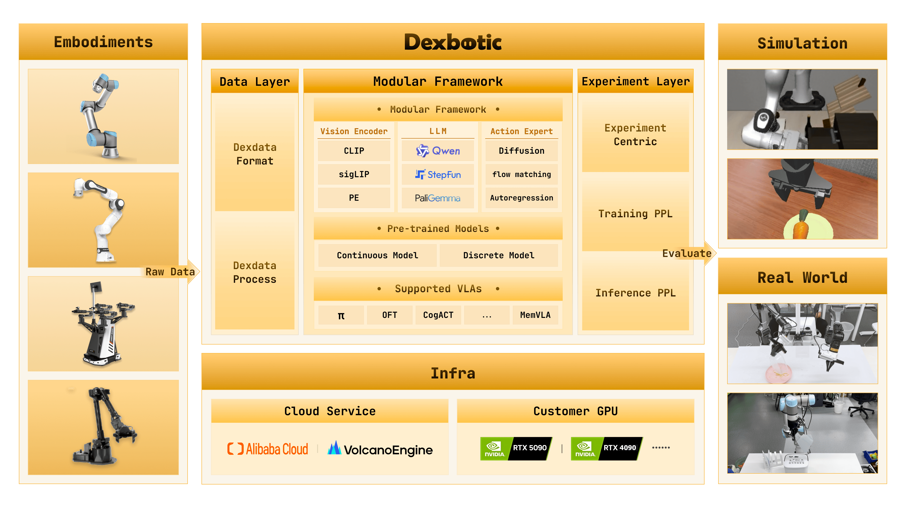

<div align="center">
  

  # 一站式具身智能 VLA 开发工具箱

  [](https://arxiv.org/pdf/2510.23511)
  [](https://huggingface.co/Dexmal)
  [](https://dexbotic.com/docs/)
  [](LICENSE)
  [](README.md)

  <p align="center">
    <strong>预训练 · 微调 · 推理 · 评测</strong><br>
    支持 π0、CogACT、OFT、MemVLA 等主流策略
  </p>
</div>

## 简介

**Dexbotic** 是一套基于 PyTorch 框架开发的 VLA（视觉-语言-动作）开发工具箱，旨在为具身智能研究提供一个统一、高效的解决方案。它内置了多种主流 VLA 模型的环境配置，用户只需简单的设置即可复现、微调和推理各种前沿算法。

- **开箱即用的 VLA 框架**：以 VLA 模型为核心，集成了具身操作和导航功能，支持多种业内领先的算法。
- **高性能预训练基础模型**：针对 π0 和 CogACT 等主流 VLA 算法，提供了多个基于 Dexbotic 优化后的预训练模型。
- **模块化开发架构**：采用「分层配置 + 工厂注册 + 入口分发」架构，用户仅需修改实验脚本，即可轻松实现配置修改、模型更换或任务添加等需求。
- **云端与本地一体化训练**：全面支持云端与本地训练需求，支持阿里云、火山引擎等云训练平台，同时适配消费级 GPU 进行本地训练。
- **广泛的机器人适配**：针对 UR5、Franka 和 ALOHA 等主流机器人，提供了**统一的训练数据格式**和部署脚本。



## 🔥 最新动态

- **[2026-03-30]** 支持 [GR00TN1](playground/benchmarks/libero/libero_gr00tn1.py) 模型。
- **[2026-03-30]** 新增 Pi05模型的[联合训练](dexbotic/exp/hybrid_pi05_exp.py) 能力。
- **[2026-03-30]**  发布了 [XLeRobot](hardware/docs/xlerobot_inference_example.md) 在 Dexbotic 中使用的教程。
- **[2026-02-10]** [DM0](docs/DM0.md) 正式发布！详情参见 [技术报告](https://dexmal.com/DM0_Tech_Report.pdf)。
- **[2026-02-10]** 合作公告：我们非常高兴地宣布与 [RLinf](https://github.com/RLinf/RLinf) 达成战略合作。双方将共同推进 VLA + RL 的研究与应用。
- **[2026-01-15]** 发布了 [SO-101](hardware/docs/so101_inference_example.md) 在 Dexbotic 中使用的教程。
- **[2026-01-15]** 支持 [GRPO](docs/RL.md)。
- **[2026-01-15]** 支持 [NaVILA](playground/example_navila_exp.py)。
- **[2026-01-08]** 新增 [联合训练](dexbotic/exp/hybrid_cogact_exp.py)能力，支持对 CogACT 模型的动作专家与 LLM 的联合优化。
- **[2026-01-08]** 发布了适配 [Blackwell GPU](#blackwell-gpus) 的专用镜像。
- **[2025-12-29]** 支持 [OFT](playground/benchmarks/libero/libero_oft.py) 和 [Pi0.5](playground/benchmarks/libero/libero_pi05.py) 模型。
- **[2025-10-20]** Dexbotic 正式发布！详情请查阅 [技术报告](https://arxiv.org/pdf/2510.23511) 和 [官方文档](https://dexbotic.com/docs/)。


## 快速开始

我们强烈推荐使用 Docker 进行开发或部署，以获得最佳的使用体验。

### 1. 安装与环境配置

```bash
# 1. 克隆代码仓库
git clone https://github.com/dexmal/dexbotic.git

# 2. 启动 Docker 容器
docker run -it --rm --gpus all --network host \
  -v $(pwd)/dexbotic:/dexbotic \
  dexmal/dexbotic \
  bash

# 3. 激活环境并安装依赖
cd /dexbotic
conda activate dexbotic
pip install -e .
```
> **系统要求**：Ubuntu 20.04/22.04，推荐使用 RTX 4090、A100 或 H100（训练建议 8 GPU，部署需 1 GPU）。

<details id="blackwell-gpus">
<summary>在 Blackwell GPU 上使用</summary>

对于使用 Blackwell 架构 GPU（例如 B100、RTX 5090）的用户，请使用专用的 Docker 镜像 `dexmal/dexbotic:c130t28`。

```bash
# 1. 使用 Blackwell 镜像启动 Docker
docker run -it --rm --gpus all --network host \
  -v /path/to/dexbotic:/dexbotic \
  dexmal/dexbotic:c130t28 \
  bash

# 2. 激活环境**
cd /dexbotic
pip install -e .
```

</details>

### 2. 使用指南

- [测试与评估](docs/Tutorial.md#evaluation)
- [基于仿真数据训练](docs/Tutorial.md#training-a-model-with-provided-data)
- [使用自有数据训练](docs/Tutorial.md#training-a-model-with-your-own-data)


## 基准测试

以下展示了基于 Dexbotic 训练的模型与原始模型在主流仿真环境下的评测结果对比。**查看更多详细评测结果**：[Benchmark Results](docs/ModelZoo.md#benchmark-results)

### Libero

| Model | Average | Libero-Spatial | Libero-Object | Libero-Goal | Libero-10 |
| --- | --- | --- | --- | --- | --- |
| CogACT | 93.6 | 97.2 | 98.0 | 90.2 | 88.8 |
| DB-CogACT | 94.9 | 93.8 | 97.8 | 96.2 | 91.8 |
| π0 | 94.2 | 96.8 | 98.8 | 95.8 | 85.2 |
| DB-π0 | 93.9 | 97 | 98.2 | 94 | 86.4 |
| MemVLA | 96.7 | 98.4 | 98.4 | 96.4 | 93.4 |
| DB-MemVLA | 97.0 | 97.2 | 99.2 | 98.4 | 93.2 |
| DB-GR00TN1 | 94.8 | 93.0 | 99.6 | 95.2 | 91.4 |

### CALVIN

| Model | Average Length | 1 | 2 | 3 | 4 | 5 |
| --- | --- | --- | --- | --- | --- | --- |
| CogACT | 3.246 | 83.8 | 72.9 | 64 | 55.9 | 48 |
| DB-CogACT | 4.063 | 93.5 | 86.7 | 80.3 | 76 | 69.8 |
| OFT | 3.472 | 89.1 | 79.4 | 67.4 | 59.8 | 51.5 |
| DB-OFT | 3.540 | 92.8 | 80.7 | 69.2 | 60.2 | 51.1 |

### SimplerEnv

| Model | Average | Spoon | Carrot | Stack Blocks | Eggplant |
| --- | --- | --- | --- | --- | --- |
| CogACT | 51.25 | 71.7 | 50.8 | 15 | 67.5 |
| DB-CogACT | 69.45 | 87.5 | 65.28 | 29.17 | 95.83 |
| OFT | 30.23 | 12.5 | 4.2 | 4.2 | 100 |
| DB-OFT | 76.39 | 91.67 | 76.39 | 43.06 | 94.44 |
| MemVLA | 71.9 | 75.0 | 75.0 | 37.5 | 100.0 |
| DB-MemVLA | 84.4 | 100.0 | 66.7 | 70.8 | 100.0 |

### ManiSkill2

| Model | Average | PickCube | StackCube | PickSingleYCB | PickSingleEGAD | PickClutterYCB |
| --- | --- | --- | --- | --- | --- | --- |
| CogACT | 40 | 55 | 70 | 30 | 25 | 20 |
| DB-CogACT | 58 | 90 | 65 | 65 | 40 | 30 |
| OFT | 21 | 40 | 45 | 5 | 5 | 0 |
| DB-OFT | 63 | 90 | 75 | 55 | 65 | 30 |
| π0 | 66 | 95 | 85 | 55 | 85 | 10 |
| DB-π0 | 65 | 95 | 85 | 65 | 50 | 30 |

### RoboTwin2.0

| Model | Average | Adjust Bottle | Grab Roller | Place Empty Cup | Place Phone Stand |
| --- | --- | --- | --- | --- | --- |
| CogACT | 43.8 | 87 | 72 | 11 | 5 |
| DB-CogACT | 58.5 | 99 | 89 | 28 | 18 |

## 常见问题

<details close>
<summary>Q: Flash-Attention 安装失败</summary>

A: 详细的安装说明和故障排查，请参阅官方文档：https://github.com/Dao-AILab/flash-attention。
</details>

<details close>
<summary>Q: RLDS/LeRobot 数据格式如何转换为 Dexdata？</summary>

A: 我们在 [数据转换指南](docs/Data.md#2-data-conversion) 中提供了一般的数据转换方法。LeRobot 数据转换的示例见 [convert_lerobot_to_dexdata](script/convert_data/convert_lerobot_to_dexdata.py)，RLDS 数据转换示例见 [convert_rlds_to_dexdata](script/convert_data/convert_rlds_to_dexdata.py)。
</details>

<details close>
<summary>Q: 5090 显卡支持吗？</summary>

A: 支持，请参考 [Blackwell 架构显卡使用](#blackwell-gpus)。
</details>

## 支持我们

我们正在不断改进，更多功能即将推出。如果你喜欢这个项目，请在 GitHub 上给我们点一颗星 [](https://github.com/dexmal/dexbotic)，你的支持是我们前进的动力！

如果 Dexbotic 对你的研究工作有所帮助，请考虑引用我们的技术报告：

```bibtex
@article{dexbotic,
  title={Dexbotic: Open-Source Vision-Language-Action Toolbox},
  author={Dexbotic Contributors},
  journal={arXiv preprint arXiv:2510.23511},
  year={2025}
}
```

## 许可

本项目采用 [MIT 许可证](LICENSE)。