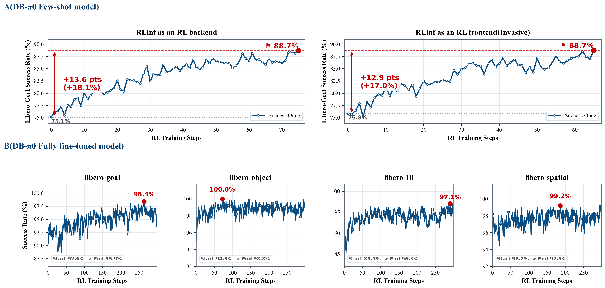

# RLinf as an RL Backend for Dexbotic

## Overview

Dexbotic can now launch reinforcement learning post-training directly from the
Dexbotic repository while using [RLinf](https://github.com/RLinf/RLinf) as the
distributed RL backend.

Previously, users started embodied RL jobs from the RLinf side, for example with
`RLinf/examples/embodiment/train_embodied_agent.py`. That workflow works well for
RLinf-native models, but it asks Dexbotic users to move model wiring, checkpoint
paths, model adapters, and task configs into an external training entrypoint.

The new flow keeps Dexbotic as the user-facing entry:

```bash
python -m dexbotic.rl.model_rl_libero_pi0 --suite=libero_goal
```

Dexbotic owns the model definition, policy adapter, and experiment config. RLinf
provides the backend services that are hard to rebuild well: cluster launch,
worker placement, rollout collection, environment workers, FSDP actor training,
checkpointing, logging, and embodied RL orchestration.
This update supports `dexbotic_pi0` and `dexbotic_dm0`.

## Runtime Environment

This workflow still depends on the RLinf embodied runtime. In practice, Dexbotic
is the launch entrypoint, while the Python environment must include the RLinf
installation and its embodied dependencies for Dexbotic models and the
`maniskill_libero` environment.

One proven setup is to install the RLinf environment from the RLinf repository:

```bash
git clone https://github.com/RLinf/RLinf.git
cd RLinf
bash requirements/install.sh embodied \
  --venv /your/venv/name \
  --model dexbotic \
  --env maniskill_libero
source /your/venv/name/bin/activate
```

After that, run the RL job from the Dexbotic repository, not from the RLinf
repository:

```bash
cd /path/to/dexbotic
python -m dexbotic.rl.model_rl_libero_pi0 --suite=libero_goal
```

## Why This Is Better

- **Dexbotic is the single entrypoint.** Users stay in the Dexbotic project for
  model development, SFT checkpoints, RL configs, and launch commands.
- **RLinf remains the RL engine.** The same RLinf `Cluster`,
  `HybridComponentPlacement`, worker groups, and `EmbodiedRunner` are reused
  without forking the RLinf training loop.
- **Models are registered dynamically.** Dexbotic registers model builders into
  RLinf at runtime with `rlinf.models.register_model`, so RLinf can instantiate
  Dexbotic policies by `model_type` just like built-in RLinf models.
- **No patching RLinf for every Dexbotic model.** New Dexbotic policies can be
  exposed through a small registry bridge instead of modifying RLinf internals.
- **A smoother open-source experience.** Fine-tuning, RL post-training, and
  evaluation all feel like Dexbotic workflows, while advanced users can still
  override Hydra configs and RLinf backend settings.

## Architecture

The integration has three small layers:

1. `dexbotic.rl.model_rl_libero_pi0`

   This is the Dexbotic-side Hydra entrypoint. It selects a local RL config such
   as `libero_goal_ppo_dexbotic_pi0.yaml`, registers Dexbotic model builders, and
   calls the shared RL launcher.

2. `dexbotic.rl.rlinf_registry`

   This module bridges Dexbotic models into RLinf. It registers entries such as
   `dexbotic_pi0` and `dexbotic_dm0` through `register_model(...)`. The same
   module also exposes a `register()` hook so RLinf Ray workers can load the
   registry through `RLINF_EXT_MODULE`.

3. `dexbotic.rl._embodied_cli`

   This is the thin backend adapter. It validates the Hydra config with RLinf,
   creates the RLinf cluster and placement strategy, launches actor, rollout,
   and environment worker groups, then starts `EmbodiedRunner`.

Conceptually, the launch path is:

```text
Dexbotic CLI
  -> Dexbotic Hydra RL config
  -> Dexbotic model registration
  -> RLinf config validation
  -> RLinf Cluster / Placement
  -> RLinf Actor + Rollout + Env workers
  -> RLinf EmbodiedRunner
```

## Dynamic Model Registration

RLinf discovers models by `model_type`. Dexbotic uses that mechanism instead of
copying Dexbotic model code into RLinf:

```python
from rlinf.models import register_model

register_model("dexbotic_pi0", build_dexbotic_pi0, category="embodied", force=True)
```

During launch, Dexbotic registers the model in the driver process before RLinf
validates or instantiates the policy. For distributed workers, Dexbotic sets:

```bash
RLINF_EXT_MODULE=dexbotic.rl.rlinf_registry
```

RLinf imports that module in each worker process and calls `register()`, giving
the driver and all workers the same custom `model_type` registry. This is the key
piece that makes RLinf feel like a backend rather than a separate application.

## Running PPO on LIBERO

Start from the Dexbotic repository and choose a LIBERO suite:

```bash
python -m dexbotic.rl.model_rl_libero_pi0 --suite=libero_goal
```

Supported suites:

- `libero_10`
- `libero_90`
- `libero_goal`
- `libero_object`
- `libero_spatial`

You can also use Hydra directly:

```bash
python -m dexbotic.rl.model_rl_libero_pi0 \
  --config-name=libero_10_ppo_dexbotic_pi0 \
  actor.model.model_path=/path/to/dexbotic-pi0-checkpoint \
  rollout.model.model_path=/path/to/dexbotic-pi0-checkpoint
```

The RL configs live under:

```text
dexbotic/config/rl/
```

For example, `libero_goal_ppo_dexbotic_pi0.yaml` composes:

- `env/libero_goal`
- `model/dexbotic_pi0`
- `training_backend/fsdp`
- PPO, rollout, logging, and checkpoint settings

## Launch Validation

When the job is started through the Dexbotic-side backend integration, the
launcher prints the following marker before RLinf creates the cluster and
workers:

```text
[Dexbotic RL] Launching from Dexbotic entrypoint with RLinf as backend.
```

If this line appears in the startup logs, it confirms that the run was launched
from Dexbotic and that RLinf is being used as the backend rather than as the
top-level frontend CLI.

## Frontend vs Backend

There are two valid ways to run the same RLinf-powered training stack:

- **RLinf as frontend:** start from the RLinf repository and launch RL directly
  with RLinf entry scripts.
- **RLinf as backend:** start from the Dexbotic repository and let Dexbotic call
  into RLinf for cluster launch, rollout workers, actor workers, and the runner.

For the same policy, algorithm, and effective config, these two launch styles
should produce the same behavior and training results. The difference is the
entrypoint and user experience, not the underlying RL execution engine.

The figure below summarizes both perspectives together: it includes
frontend/backend comparison views and additional training-effect results in one
place.



In other words, Dexbotic-as-entrypoint is intended to be operationally smoother
for Dexbotic users, while keeping training semantics aligned with the original
RLinf workflow.

## Extending to New Dexbotic Policies

To add another Dexbotic policy as an RLinf-backed RL model:

1. Implement a policy adapter under `dexbotic/rl/rlinf_bridge/`.
2. Expose a `get_model(cfg, torch_dtype)` function that returns an RLinf-compatible policy.
3. Register a new `model_type` in `dexbotic.rl.rlinf_registry`.
4. Add a model config under `dexbotic/config/rl/model/`.
5. Compose it into a task config under `dexbotic/config/rl/`.
6. Launch from Dexbotic with a small CLI entrypoint or a Hydra `--config-name` override.

This keeps the integration modular: Dexbotic evolves its model zoo and adapters,
while RLinf continues to handle scalable RL execution.

## Design Principle

The goal is not to hide RLinf. The goal is to put each project in its strongest
role:

- Dexbotic provides the robot policy, checkpoint lineage, model-specific data
  transforms, and user-facing experiment entrypoint.
- RLinf provides the reliable distributed RL backend for rollouts, optimization,
  placement, logging, and runner orchestration.

With this split, RL post-training becomes a natural continuation of Dexbotic
model development: register the policy, point the config at a checkpoint, and
launch RL from the same place where the model was built.
