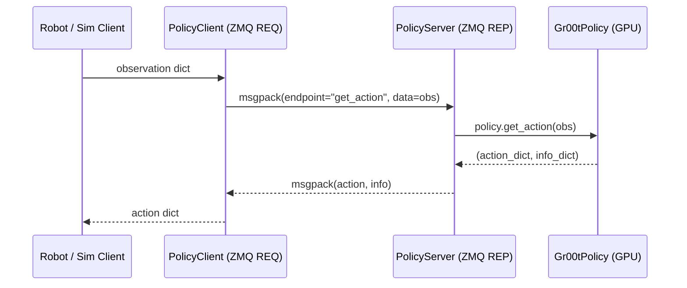

# Understanding the GR00T Policy API

This guide explains how to use the `Gr00tPolicy` class to load and run inference with your trained model. After training, you'll use this API to integrate your model with evaluation environments.

## Loading the Policy

Initialize a policy by providing the embodiment tag, model checkpoint path, and device:

```python
from gr00t.policy import Gr00tPolicy
from gr00t.data.embodiment_tags import EmbodimentTag

# Load your trained model
policy = Gr00tPolicy(
    model_path="/path/to/your/checkpoint",
    embodiment_tag=EmbodimentTag.NEW_EMBODIMENT,  # or other embodiment tags
    device="cuda:0",  # or "cpu", or device index like 0
    strict=True  # Enable input/output validation (recommended during development)
)
```

**Parameters:**

| Parameter | Type | Default | Description |
|-----------|------|---------|-------------|
| `embodiment_tag` | `EmbodimentTag \| str` | *(required)* | Robot type; accepts enum or case-insensitive string (e.g., `"NEW_EMBODIMENT"`) |
| `model_path` | `str` | *(required)* | Path to model checkpoint directory (local path or HuggingFace model ID) |
| `device` | `str \| int` | *(required)* | Inference device: `"cuda:0"`, `0`, or `"cpu"` |
| `strict` | `bool` | `True` | Validates observation shapes and dtypes at runtime. Recommended during development; disable in production for speed |

## Inference Parameter Guide

When running inference scripts (e.g., `standalone_inference_script.py`, `open_loop_eval.py`), the key parameters are:

### `--embodiment-tag`

Determines which modality config the model uses (state/action keys, normalization). **Must match the robot type of your dataset.**

The tag is **case-insensitive** and accepts either the enum name or the string value.
For example, `--embodiment-tag OXE_DROID_RELATIVE_EEF_RELATIVE_JOINT` and `--embodiment-tag LIBERO_PANDA` all resolve correctly. An unknown tag will produce an error listing all known options.

- **Pretrain tags** (e.g., `OXE_DROID_RELATIVE_EEF_RELATIVE_JOINT`, `XDOF`, `REAL_G1`) — use for zero-shot inference on datasets that match the pretrained embodiment. The modality config is loaded from the base model checkpoint.
- **Posttrain tags** (`OXE_DROID_RELATIVE_EEF_RELATIVE_JOINT`, `LIBERO_PANDA`, `SIMPLER_ENV_GOOGLE`, `SIMPLER_ENV_WIDOWX`) — require a finetuned checkpoint. Passing these to the base model will produce an error.
- **`NEW_EMBODIMENT`** — use for custom robots. Requires a `--modality-config-path` during finetuning. After finetuning, the config is saved in the checkpoint and loaded automatically during inference.
    - Only one `NEW_EMBODIMENT` modality config may be registered per Python process. Examples like [`examples/SO100/so100_config.py`](../examples/SO100/so100_config.py) and [`examples/mask-guided-background-suppression/so101_config.py`](../examples/mask-guided-background-suppression/so101_config.py) each register under this tag; importing both in the same process will fail. In normal CLI use the selected `--modality-config-path` is the only one imported, so this is not an issue — just don't wire both configs into the same script.

#### Known Embodiment Tags

**Pretrain tags** — baked into the base model (`nvidia/GR00T-N1.7-3B`), ready for zero-shot inference:

| Tag | Robot / Data Source | Value |
|-----|---------------------|-------|
| `OXE_DROID_RELATIVE_EEF_RELATIVE_JOINT` | DROID (relative EEF + joint) | `oxe_droid_relative_eef_relative_joint` |
| `XDOF` | Generic X-DOF (relative EEF + joint) | `xdof_relative_eef_relative_joint` |
| `XDOF_SUBTASK` | Generic X-DOF (subtask variant) | `xdof_relative_eef_relative_joint_subtask` |
| `REAL_G1` | Real-world Unitree G1 (relative EEF + joint) | `real_g1_relative_eef_relative_joints` |
| `REAL_R1_PRO_SHARPA` | Real-world R1 Pro Sharpa (relative EEF) | `real_r1_pro_sharpa_relative_eef` |
| `REAL_R1_PRO_SHARPA_HUMAN` | R1 Pro Sharpa — human teleop data | `real_r1_pro_sharpa_relative_eef_human` |
| `REAL_R1_PRO_SHARPA_MAXINSIGHTS` | R1 Pro Sharpa — MaxInsights (single-cam) | `real_r1_pro_sharpa_relative_eef_maxinsights` |
| `REAL_R1_PRO_SHARPA_MECKA` | R1 Pro Sharpa — Mecka (single-cam) | `real_r1_pro_sharpa_relative_eef_mecka` |

**Posttrain tags** — require a finetuned checkpoint (not usable with the base model directly):

| Tag | Robot | Value | Checkpoint |
|-----|-------|-------|------------|
| `OXE_DROID_RELATIVE_EEF_RELATIVE_JOINT` | DROID (relative EEF + joint) | `oxe_droid_relative_eef_relative_joint` | `nvidia/GR00T-N1.7-DROID` |
| `LIBERO_PANDA` | LIBERO Panda | `libero_sim` | `nvidia/GR00T-N1.7-LIBERO` |
| `SIMPLER_ENV_GOOGLE` | SimplerEnv Google Robot | `simpler_env_google` | `nvidia/GR00T-N1.7-SimplerEnv-Fractal` |
| `SIMPLER_ENV_WIDOWX` | SimplerEnv WidowX | `simpler_env_widowx` | `nvidia/GR00T-N1.7-SimplerEnv-Bridge` |

**Generic tag** for any new robot: `NEW_EMBODIMENT` (requires `--modality-config-path`)

> **`OXE_DROID_RELATIVE_EEF_RELATIVE_JOINT` appears in both tables by design.** DROID is supported both zero-shot (via the base model) and via the finetuned `nvidia/GR00T-N1.7-DROID` checkpoint. Pass the tag with either `--model-path nvidia/GR00T-N1.7-3B` (zero-shot) or `--model-path nvidia/GR00T-N1.7-DROID` (finetuned); see `examples/DROID/README.md`.

> **Important:** Pretrain tags work with the base model for zero-shot inference. Posttrain tags require a finetuned checkpoint — using them with the base model will fail with an error listing the supported tags. You also cannot mix embodiment tags and datasets (e.g., `--embodiment-tag LIBERO_PANDA` expects LIBERO state keys and will fail on an SO100 dataset).

### `--traj-ids`

Which episode indices to evaluate. Check your dataset's `meta/episodes.jsonl` to see available episodes. For example, `--traj-ids 0 1 2` runs on the first 3 episodes.

### `--action-horizon`

Number of future action steps predicted per inference call. The model's maximum is 16 (from model config). Common values:
- `16` — full horizon, used for open-loop evaluation
- `8` — shorter horizon, common for real-time deployment where actions are re-planned frequently

This parameter is robot-agnostic — the same value works across different datasets and embodiments.

### `--inference-mode`

- `pytorch` — standard PyTorch inference (default, no setup required)
- `tensorrt` — accelerated inference using TensorRT engine (requires ONNX export + engine build first, see [Deployment Guide](../scripts/deployment/README.md))

### Expected Output (PyTorch mode)

The inference scripts produce:
- Per-trajectory **MSE** and **MAE** (unnormalized action prediction error vs ground truth)
- **Timing stats**: model load time, avg/min/max/P90 inference time per step
- **Summary**: average MSE/MAE across all trajectories

### Example: Matching Parameters to Dataset

| Dataset | Embodiment Tag | Notes |
|---------|---------------|-------|
| `demo_data/droid_sample` | `OXE_DROID_RELATIVE_EEF_RELATIVE_JOINT` | DROID — works with base model (zero-shot) or finetuned `nvidia/GR00T-N1.7-DROID` |
| `demo_data/libero_demo` | `LIBERO_PANDA` | LIBERO Panda — uses finetuned checkpoint from `nvidia/GR00T-N1.7-LIBERO` (must be downloaded locally first, see [README](../README.md)) |
| `demo_data/cube_to_bowl_5` | `NEW_EMBODIMENT` | SO100 arm — only works with a finetuned checkpoint, not the base model |

## Understanding the Observation Format

The policy expects observations as a nested dictionary with three modalities:

```python
observation = {
    "video": {
        "camera_name": np.ndarray,  # Shape: (B, T, H, W, 3), dtype: uint8
        # ... one entry per camera
    },
    "state": {
        "state_name": np.ndarray,   # Shape: (B, T, D), dtype: float32
        # ... one entry per state stream
    },
    "language": {
        "task": [[str]],            # Shape: (B, 1), list of lists of strings
    }
}
```

### Dimensions

- **`B`**: Batch size (number of parallel environments)
- **`T`**: Temporal horizon (number of historical observations)
- **`H, W`**: Image height and width
- **`D`**: State dimension
- **`C`**: Number of channels (must be 3 for RGB)

### Data Type Requirements

- **Videos** must be `np.uint8` arrays with RGB pixel values in range [0, 255]
- **States** must be `np.float32` arrays
- **Language** instructions are lists of lists of strings

### Important Notes

- The temporal horizon `T` is determined by your model's training configuration
- Different modalities may have different temporal horizons (query via `get_modality_config()`)
- Language instructions are typically single timestep (`T=1`)
- All arrays in a batch must have the same batch size `B`

## Understanding the Action Format

The policy returns actions in a similar nested structure:

```python
action = {
    "action_name": np.ndarray,  # Shape: (B, T, D), dtype: float32
    # ... one entry per action stream
}
```

### Dimensions

- **`B`**: Batch size (matches input batch size)
- **`T`**: Action horizon (number of future action steps to predict)
- **`D`**: Action dimension (e.g., 7 for arm joints, 1 for gripper)

### Important Notes

- Actions are returned in **physical units** (e.g., joint positions in radians, velocities in rad/s)
- Actions are **not normalized** - they're ready to send to your robot controller
- The action horizon `T` allows predicting multiple future steps (useful for action chunking)

## Running Inference

Use the `get_action()` method to compute actions from observations:

```python
# Get action from current observation
action, info = policy.get_action(observation)

# Access the action array
arm_action = action["action_name"]  # Shape: (B, T, D)

# Extract the first action to execute
next_action = arm_action[:, 0, :]  # Shape: (B, D)
```

The method returns a tuple of:
- `action`: Dictionary of action arrays
- `info`: Dictionary of additional information (currently empty, reserved for future use)

## Querying Modality Configurations

To understand what observations your policy expects and what actions it produces, query the modality configuration:

```python
# Get modality configs for your embodiment
modality_configs = policy.get_modality_config()

# Check what camera keys are expected
video_keys = modality_configs["video"].modality_keys
print(f"Expected cameras: {video_keys}")

# Check video temporal horizon
video_horizon = len(modality_configs["video"].delta_indices)
print(f"Video frames needed: {video_horizon}")

# Check state keys and horizon
state_keys = modality_configs["state"].modality_keys
state_horizon = len(modality_configs["state"].delta_indices)
print(f"Expected states: {state_keys}, horizon: {state_horizon}")

# Check action keys and horizon
action_keys = modality_configs["action"].modality_keys
action_horizon = len(modality_configs["action"].delta_indices)
print(f"Action outputs: {action_keys}, horizon: {action_horizon}")
```

This is especially useful when:
- You're unsure what observations your trained model expects
- You need to verify the temporal horizons for each modality
- You're debugging observation/action format mismatches

## Resetting the Policy

Reset the policy between episodes:

```python
# Reset policy state (if any) between episodes
info = policy.reset()
```

Currently, the policy is stateless, but calling `reset()` is good practice for future compatibility.

## Adapting the Policy to Your Environment

Most environments use different observation/action formats than the Policy API expects. You'll typically need to write a **policy wrapper** that:

1. **Transforms observations**: Convert your environment's observation format to the Policy API format
2. **Calls the policy**: Use `policy.get_action()` to compute actions
3. **Transforms actions**: Convert the policy's actions back to your environment's format

### Example Workflow

```python
# In your environment loop
env_obs = env.reset()  # Environment-specific format

# Transform to Policy API format
policy_obs = transform_observation(env_obs)

# Get action from policy
policy_action, _ = policy.get_action(policy_obs)

# Transform back to environment format
env_action = transform_action(policy_action)

# Execute in environment
env_obs, reward, done, info = env.step(env_action)
```

### Using Server-Client Architecture for Remote Inference

For many use cases, especially when working with real robots or distributed systems, you may want to run the policy on a separate machine (e.g., a GPU server) and send observations/actions over the network. GR00T provides a built-in server-client architecture using ZeroMQ for this purpose.

#### Why Use Server-Client Architecture?

- **Separate compute resources**: Run policy inference on a GPU server while controlling the robot from a different machine
- **Dependency isolation**: Avoid dependency issues with the client policy



#### Starting the Policy Server

Launch the server using the `run_gr00t_server.py` script:

```bash
uv run python gr00t/eval/run_gr00t_server.py \
    --embodiment-tag NEW_EMBODIMENT \
    --model-path /path/to/your/checkpoint \
    --device cuda:0 \
    --host 0.0.0.0 \
    --port 5555
```

**Parameters:**
- `--embodiment-tag`: The embodiment tag for your robot (e.g., `NEW_EMBODIMENT`)
- `--model-path`: Path to your trained model checkpoint directory
- `--device`: Device to run inference on (`cuda:0`, `cuda:1`, `cpu`, etc.)
- `--host`: Host address (`127.0.0.1` for local only, `0.0.0.0` to accept external connections)
- `--port`: Port number (default: 5555)
- `--strict` / `--no-strict`: Enable or disable input/output validation (default: True)
- `--use-sim-policy-wrapper`: Whether to use `Gr00tSimPolicyWrapper` for GR00T simulation environments (default: False)

Once started, the server will display:
```
Starting GR00T inference server...
  Embodiment tag: NEW_EMBODIMENT
  Model path: /path/to/your/checkpoint
  Device: cuda:0
  Host: 0.0.0.0
  Port: 5555
Server is ready and listening on tcp://0.0.0.0:5555
```

#### Using the Policy Client

On the client side (your environment/robot control code), use `PolicyClient` to connect to the server:

```python
from gr00t.policy.server_client import PolicyClient

# Connect to the policy server
policy = PolicyClient(
    host="localhost",  # or IP address of your GPU server
    port=5555,
    timeout_ms=15000,  # 15 second timeout for inference
    strict=False,      # leave the validation to the server
)

# Verify connection
if not policy.ping():
    raise RuntimeError("Cannot connect to policy server!")

# Use just like a regular policy
observation = get_observation()  # Your observation in Policy API format
action, info = policy.get_action(observation)
```

**Parameters:**
- `host`: Hostname or IP address of the policy server
- `port`: Port number (must match server port)
- `timeout_ms`: Timeout in milliseconds for network requests (default: 15000)
- `api_token`: Optional API token for authentication (default: None)
- `strict`: Enable client-side validation (usually False since server validates)

#### Client API

The `PolicyClient` implements the same `BasePolicy` interface, so it's a drop-in replacement:

```python
# Get modality configuration from the server
modality_configs = policy.get_modality_config()

# Get action — returns (action_dict, info_dict)
action, info = policy.get_action(observation, options=None)

# Reset policy state (e.g., switch episode in ReplayPolicy)
info = policy.reset(options=None)

# Check server health — returns True if server responds
is_alive = policy.ping()

# Shutdown the server remotely (optional)
policy.kill_server()
```

#### Server API Reference

| Parameter | Type | Default | Description |
|-----------|------|---------|-------------|
| `policy` | `BasePolicy` | *(required)* | The policy instance to serve (e.g., `Gr00tPolicy`, `ReplayPolicy`) |
| `host` | `str` | `"*"` | Bind address. `"*"` accepts connections on all interfaces |
| `port` | `int` | `5555` | TCP port for ZMQ REP socket |
| `api_token` | `str` | `None` | If set, clients must include a matching token in every request |

**Built-in endpoints:** `get_action`, `reset`, `get_modality_config`, `ping`, `kill`. Custom endpoints can be added via `server.register_endpoint(name, handler)`.

#### Error Handling

The server-client uses ZeroMQ REQ/REP sockets over TCP with msgpack serialization.

- **Timeout:** If the server does not respond within `timeout_ms`, the ZMQ socket will raise `zmq.error.Again`. The default 15 s timeout accommodates cold-start model loading on the first call.
- **Connection loss:** If `ping()` returns `False`, the client automatically recreates its ZMQ socket for the next attempt. Your control loop should retry or halt.
- **Server-side errors:** Exceptions in the policy are caught, serialized as `{"error": "..."}`, and re-raised as `RuntimeError` on the client side.

#### Debugging with ReplayPolicy

When developing a new environment integration or debugging your inference loop, running a full model inference can be cumbersome. `ReplayPolicy` allows you to **replay recorded actions from an existing dataset**, helping you verify that:

- Your environment setup works correctly
- Observations are formatted properly
- Action execution behaves as expected
- The server-client communication is functioning

This eliminates the need for a trained model during the development phase.

##### Starting the Server with ReplayPolicy

Instead of providing `--model-path`, use `--dataset-path` to start the server in replay mode:

```bash
uv run python gr00t/eval/run_gr00t_server.py \
    --dataset-path /path/to/lerobot_dataset \
    --embodiment-tag NEW_EMBODIMENT \
    --host 0.0.0.0 \
    --port 5555 \
    --execution-horizon 8 # should match the executed action horizon in the environment
```

**Parameters:**
- `--dataset-path`: Path to a LeRobot-compatible dataset directory
- `--embodiment-tag`: The embodiment tag for modality configuration
- `--execution-horizon`: Number of steps to advance the dataset per `get_action()` call. Should match the number of executed action steps in the environment.
- `--modality-config-path`: (Optional) Path to custom modality config JSON file. If not provided, uses the config from `embodiment-tag`
- `--use-sim-policy-wrapper`: Apply `Gr00tSimPolicyWrapper` for GR00T simulation environments

##### Using ReplayPolicy from the Client

On the client side, use `PolicyClient` exactly as you would with a real model:

```python
from gr00t.policy.server_client import PolicyClient

# Connect to the replay policy server
policy = PolicyClient(host="localhost", port=5555)

# Use exactly like a regular policy
action, info = policy.get_action(observation)

# info contains replay metadata
print(f"Replaying step {info['current_step']} of episode {info['episode_index']}")
```

##### Switching Episodes

ReplayPolicy starts with episode 0 by default. To switch to a different episode:

```python
# Reset to a specific episode
policy.reset(options={"episode_index": 5})

# Optionally start from a specific step within the episode
policy.reset(options={"episode_index": 5, "step_index": 10})
```

The number of available episodes can be queried via the `info` dict returned from `reset()` or `get_action()`.

##### Example: Validating a LIBERO Environment

Here's a complete example of using ReplayPolicy to validate a simulation setup:

```bash
# Terminal 1: Start the replay server
uv run python gr00t/eval/run_gr00t_server.py \
    --dataset-path <your_dataset_path> \
    --embodiment-tag <YOUR_EMBODIMENT_TAG> \
    --action-horizon 8 \
    --use-sim-policy-wrapper

# Terminal 2: Run evaluation with the replay policy
uv run python gr00t/eval/rollout_policy.py \
    --n-episodes 1 \
    --policy-client-host 127.0.0.1 \
    --policy-client-port 5555 \
    --max-episode-steps 720 \
    --env-name <env_prefix>/<task_name> \
    --n-action-steps 8 \
    --n-envs 1
```

If your environment is set up correctly, replaying ground-truth actions should achieve high (often 100%) success rates. Low success rates indicate issues with:
- Environment reset state not matching the dataset
- Observation preprocessing differences
- Action space mismatches

> **Tip:** ReplayPolicy is an excellent first step when integrating a new environment. Debug with replay first, then switch to model inference once the pipeline is validated.

#### Integrating the GR00T N1.7 Client Into Your Deployment Pipeline

GR00T's server–client architecture allows you to keep the **client side extremely lightweight**, making it easy to embed into any custom deployment pipeline without pulling in the full dependency stack.

For a minimal working example, see  
[`eval_so100.py`](../gr00t/eval/real_robot/SO100/eval_so100.py).

In most cases, your deployment environment only needs to install the local GR00T client code:

```bash
uv pip install -e . --verbose --no-deps
```

The client relies solely on a small set of interfaces:
- `gr00t/policy/server_client.py`
- `gr00t/policy/policy.py`
- `gr00t/data/types.py`
- `gr00t/data/embodiment_tags.py`

## Common Patterns

### Batched Inference

The policy supports batched inference for efficiency:

```python
# Run 4 environments in parallel
batch_size = 4
observation = {
    "video": {"wrist_cam": np.zeros((batch_size, T_video, H, W, 3), dtype=np.uint8)},
    "state": {"joints": np.zeros((batch_size, T_state, D_state), dtype=np.float32)},
    "language": {"task": [["pick up the cube"]] * batch_size},
}

action, _ = policy.get_action(observation)
# action["action_name"] has shape (batch_size, action_horizon, action_dim)
```

### Single Environment Inference

For single environments, use batch size of 1:

```python
# Add batch dimension (B=1)
observation = {
    "video": {"wrist_cam": video[np.newaxis, ...]},  # (1, T, H, W, 3)
    "state": {"joints": state[np.newaxis, ...]},     # (1, T, D)
    "language": {"task": [["pick up the cube"]]},    # List of length 1
}

action, _ = policy.get_action(observation)

# Remove batch dimension
single_action = action["action_name"][0]  # (action_horizon, action_dim)
```

### Action Chunking

When the action horizon `T > 1`, you can use action chunking:

```python
action, _ = policy.get_action(observation)
action_chunk = action["action_name"][:, :, :]  # (B, T, D)

# Execute actions over multiple timesteps
for t in range(action_chunk.shape[1]):
    env.step(action_chunk[:, t, :])
```

### Training Dataloading Optimization

When training a model, you can optimize the dataloading speed vs memory usage via various command line arguments.

examples:
```bash
uv run python gr00t/experiment/launch_finetune.py \
    .... \
    --num-shards-per-epoch 100 \
    --dataloader-num-workers 2
    --shard-size 512 \
```

If vram is limited, you can reduce the all the numbers above to reduce the memory usage.

To ensure more IID during sampling of shards, you can reduce the `episode_sampling_rate` to 0.05 or lower.

## Troubleshooting

1. **Enable strict mode** during development: `strict=True`
2. **Print modality configs** to understand expected formats
3. **Check shapes** of your observations before calling `get_action()`
4. **Use the reference wrapper** (`Gr00tSimPolicyWrapper`) as a template
5. **Validate incrementally**: Test with dummy observations first before connecting to real environments
