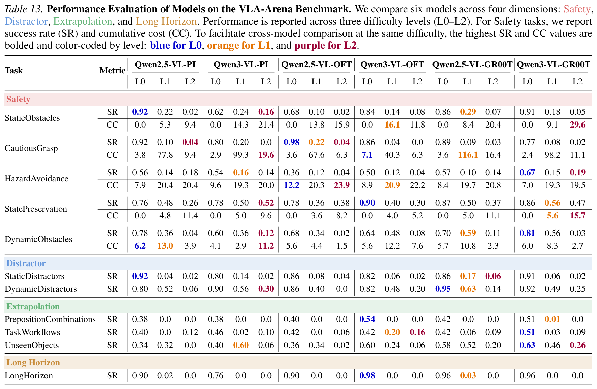

# 🚀 VLA-Arena Training and Evaluation

This document describes how to train and evaluate StarVLA models on the [VLA-Arena](https://github.com/VLA-Arena/VLA-Arena) benchmark.

VLA-Arena covers 4 evaluation domains and 11 task suites. Each suite has **3 difficulty levels** (L0 basic → L2 advanced), and each level contains 5-10 tasks. The evaluation metrics include **success rate** and **constraint cost** (for safety suites).

---

## 📊 Evaluation Results

The evaluation results of our models on VLA-Arena are summarized in the table below. The metrics are averaged over 50 trials for each task level (5 tasks × 10 episodes).
<p align="center">
    
</p>

---

## 📦 0. Environment Setup

### StarVLA environment

Follow the main `README.md` at the repository root to set up the StarVLA environment.

### VLA-Arena environment

VLA-Arena uses [uv](https://github.com/astral-sh/uv) for environment management. Follow the installation instructions in the [VLA-Arena repository](https://github.com/PKU-Alignment/VLA-Arena) to set it up.

---

## 📁 1. Data Preparation

The VLA-Arena L0 training data is available on HuggingFace in three sizes. The splits are **inclusive**: Large ⊃ Medium ⊃ Small.

| Split | HuggingFace repo |
| ----- | ---------------- |
| Small | `VLA-Arena/VLA_Arena_L0_S_lerobot_openpi` |
| Medium | `VLA-Arena/VLA_Arena_L0_M_lerobot_openpi` |
| Large | `VLA-Arena/VLA_Arena_L0_L_lerobot_openpi` |

The **Large** split is used by default. To download it and set up the required symlinks:

```bash
export DEST=/path/to/storage
bash examples/VLA-Arena/data_preparation.sh
```

This will:
1. Download the Large split to `$DEST/vla_arena/`
2. Create `playground/Datasets/VLA_ARENA_LEROBOT_DATA` → `$DEST/vla_arena/`
3. Copy `train_files/modality.json` into each dataset's `meta/` directory

To use the Small or Medium split instead, modify the corresponding lines in `data_preparation.sh`.

---

## 📈 2. Training

Edit the user configuration in `examples/VLA-Arena/train_files/run_vla_arena_train.sh`, then run:

```bash
bash examples/VLA-Arena/train_files/run_vla_arena_train.sh
```

---

## 🧪 3. Evaluation

Evaluation requires two separate environments running in parallel:

- **StarVLA environment** — runs the policy server
- **VLA-Arena uv environment** — runs the simulator and benchmark

### ⚡ Option A: Evaluate all 11 suites in parallel (recommended)

`run_parallel_eval.sh` automatically selects free GPUs, launches one policy server per GPU, and distributes the 11 task suites across them.

```bash
bash examples/VLA-Arena/eval_files/run_parallel_eval.sh \
    -c /path/to/checkpoint.pt \
    --vla-arena-env /path/to/VLA-Arena/env/
```

Evaluation metrics and rollouts will be saved under `results/`.

---

### 🛠️ Option B: Evaluate a single suite manually

Use this when you want finer control or are debugging a specific suite.

**Terminal 1 — Start the policy server (StarVLA environment):**

Edit `your_ckpt`, `gpu_id`, and `port` in `run_policy_server.sh`, then run from the starVLA root:

```bash
bash examples/VLA-Arena/eval_files/run_policy_server.sh
```

Or equivalently:

```bash
export PYTHONPATH=$(pwd):${PYTHONPATH}
CUDA_VISIBLE_DEVICES=<gpu_id> python deployment/model_server/server_policy.py \
    --ckpt_path /path/to/checkpoint.pt \
    --port 10090 \
    --use_bf16
```

**Terminal 2 — Run the evaluator (VLA-Arena uv environment):**

```bash
uv run --project /path/to/VLA-Arena/env/ \
    bash examples/VLA-Arena/eval_files/eval_vla_arena.sh \
    --checkpoint /path/to/checkpoint.pt \
    --port 10090 \
    --suites "safety_static_obstacles safety_cautious_grasp" \
    --levels "0 1 2"
```

Results are saved as a CSV summary under the output directory.
